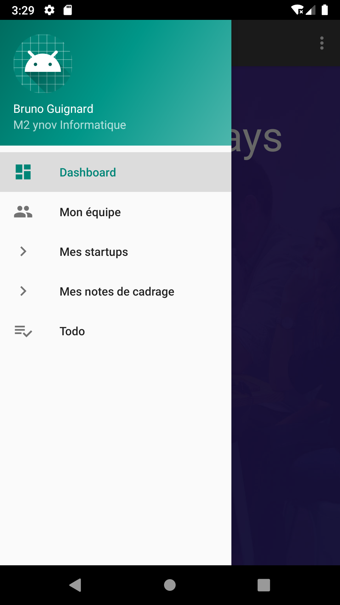
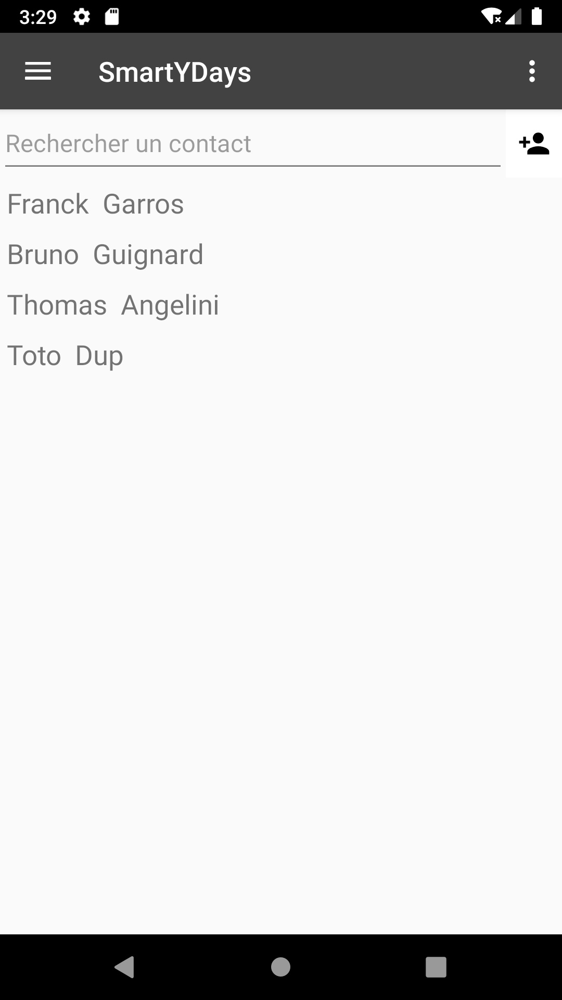
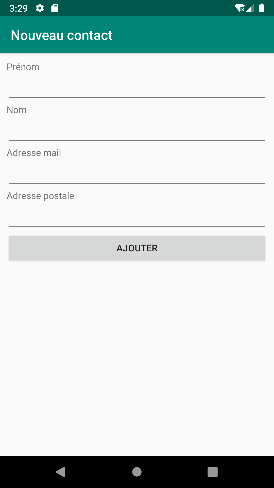
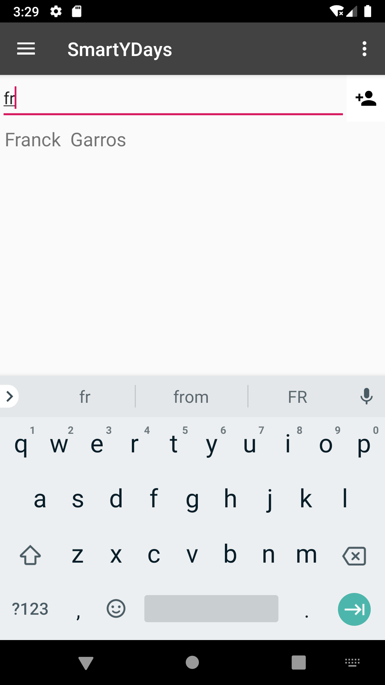
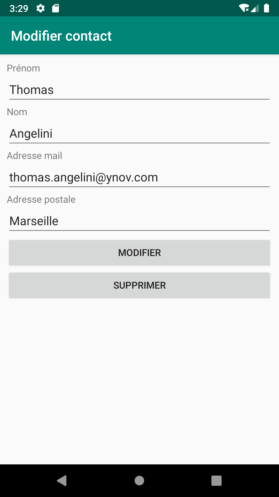
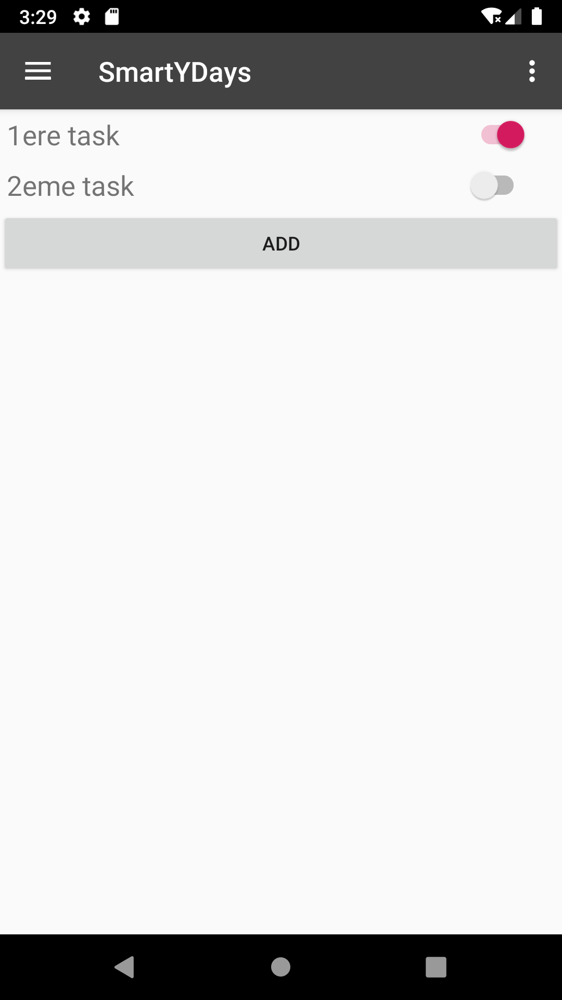
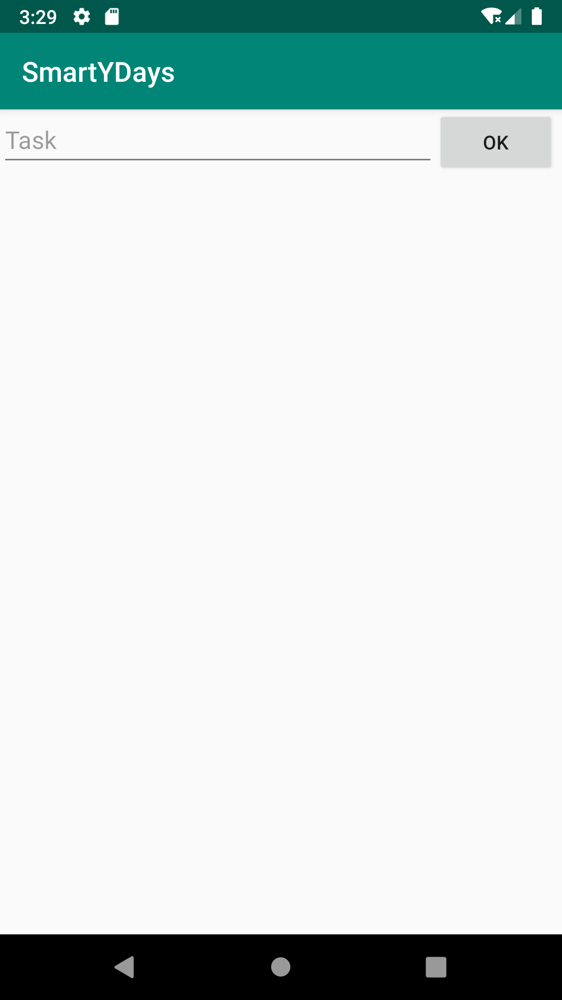

# Application SmartYDays
Par Thomas Angelini, Franck Garros et Bruno Guignard

## Concept

## Fonctionnalités développées
* Gestion d'une équipe (style répertoire)
* Todo list 

## Spécificités
* Des fichiers de layout
* Affichage d’une liste d’éléments (RecyclerView)
* Utilisation de la bibliothèque Anko
* Utilisation d’une boîte de dialogue (Snackbar pour les vérifications du formulaire pour ajouter un contact)
* Utilisation d’une Base de Données locale (SQLite)

## Screenshots
### Accueil

-----------------
### Menu

-----------------
### Equipe

-----------------
### Equipe - Nouveau

-----------------
### Equipe - Recherche

-----------------
### Equipe - Modifier

-----------------
### Todo - Liste

-----------------
### Todo - Nouveau

-----------------